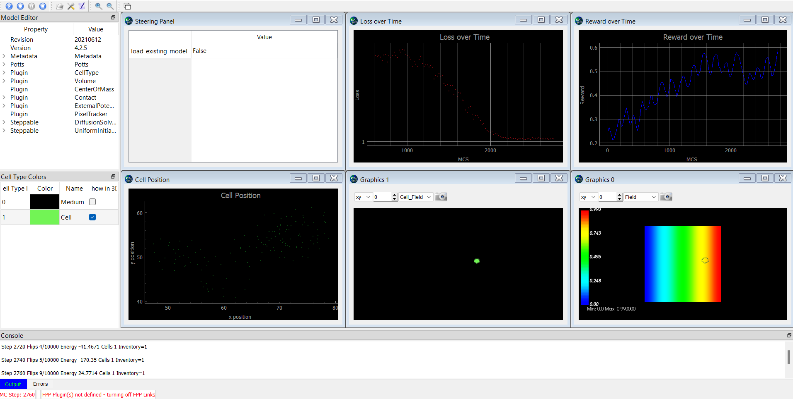

# Deep-Reinforcement-Learning-For-Chemotactic-Behavior-Using-CC3D

In this application, we present a deep learning approach for optimizing bacterial chemotaxis within the CompuCell3D framework, a powerful agent-based simulation platform for studying multi-scale cellular phenomena. Our study focuses on the run-and-tumble model of bacterial motion, which is characterized by periods of straight "runs" interspersed with random "tumbles" that change the cell's direction. We aim to optimize the chemotactic behavior of the bacteria in response to a spatially distributed food source by modulating three key output parameters: the probability of tumbling, the persistence of the cell, and its sensitivity to environmental stimuli. Importantly, this work serves as a foundation and a proof of principle that deep learning techniques as derived from Keras and TensorFlow can be implemented within CC3D for a variety of different purposes. 

This simulation is built using [CompuCell3D](https://compucell3d.org/) multicellular modeling environment. 

For more information on the methods used, please see the following document: 

[Download document](./Methods.pdf)

## Learning Objectives/Exercises 

For the best experience please follow along with the methods document.

### Activity 1: Observing Bacterial Run and Tumble Behavior in a Chemical Gradient

a. Watch the untrained CompuCell3D simulation of bacterial run-and-tumble behavior as the bacteria swim up a chemical gradient. Take note of the key features of the behavior, such as the duration and frequency of running and tumbling.

b. Analyze how the bacteria's movement is affected by the chemical gradient. Record your thoughts on the role of chemotaxis in their behavior and how they optimize their search for resources.

c. Observe the differences in individual bacterial trajectories and write down possible reasons for the variability in their movement patterns. What parameters are causing the bacteria to change direction?

### Activity 2: Identifying Key Simulation Parameters

a. Review the information provided on the polarity, persistence, sensitivity, and probability of tumbling parameters that were optimized in the CompuCell3D simulation. Record the roles of these parameters in a run-and-tumble behavior.

b. Analyze how each parameter value contributes to the efficiency of the bacteria's chemotactic response within the simulation.

c. Take a moment to compare the behavior between different trained models. Are they all the same? 

d. On the steering panel, select the option to start from an untrained model. How does its behavior change over time? 

### Activity 3: Comparing Simulated Behavior with Real-Life Observations

a. Watch video recordings of real bacteria exhibiting run-and-tumble behavior in response to chemical gradients. Compare and contrast the observed behaviors with the simulated behavior in the CompuCell3D model.

b. Identify and list any discrepancies between the real-life observations and the simulated behavior. Explore possible reasons for these differences, such as limitations in the model or differences in environmental conditions.

c. Investigate recent research articles on bacterial run and tumble behavior and chemotaxis. Write a summary of how the simulation model in CompuCell3D aligns with current scientific understanding.

### Activity 4: Reflecting on the Interplay of Biology and Computer Science

a. How might computer simulations, such as the CompuCell3D model shown here, enhance our understanding of complex biological processes like bacterial run-and-tumble behavior? How can different methods in cognitive science help us in our pursuit to understand biological systems? 

b. Explore the challenges and limitations associated with developing accurate simulations of biological systems. Consider the role of parameter optimization and deep learning techniques, such as TensorFlow, in addressing these challenges.

c. Reflect on the potential applications of computer simulations in advancing research and innovation in fields such as microbiology, medicine, and biotechnology. Specifically, consider ways in which optimization techniques like this could be used for different biological simulations. Discuss the potential benefits and limitations of these techniques for the scientific community.

